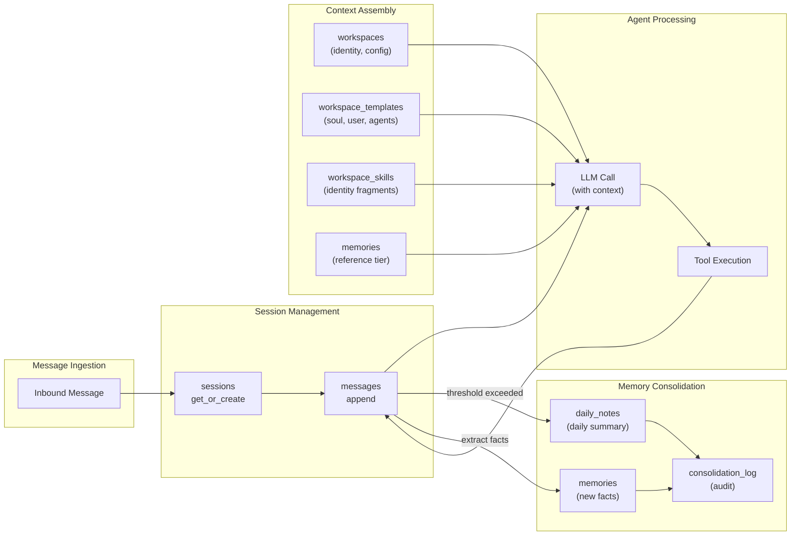

# Data Model

## Entity Relationship Diagram

```mermaid
erDiagram
    WORKSPACES {
        text id PK "UUID primary key"
        text name UK "Unique workspace name"
        text identity "Legacy identity markdown"
        jsonb config_overrides "Per-workspace config"
        text status "active | paused | archived"
        timestamptz created_at "Auto-set on create"
        timestamptz updated_at "Auto-set on update"
    }

    SESSIONS {
        text id PK "UUID primary key"
        text workspace_id FK "References workspaces(id)"
        text channel "telegram | discord | slack | ..."
        text channel_identifier "chat_id or user_id"
        jsonb metadata "Channel-specific metadata"
        timestamptz last_consolidated_at "Last memory consolidation"
        timestamptz created_at "Auto-set on create"
    }

    MESSAGES {
        serial id PK "Auto-increment primary key"
        text session_id FK "References sessions(id)"
        text role "user | assistant | system | tool"
        text content "Message text content"
        jsonb metadata "Tool calls, media, etc."
        boolean consolidated "Marked after consolidation"
        timestamptz created_at "Auto-set on create"
    }

    MEMORIES {
        text id PK "UUID primary key"
        text workspace_id FK "References workspaces(id)"
        text category "fact | preference | event | summary"
        text content "Memory content text"
        vector embedding "vector(1536) - reserved for RAG"
        text tier "active | reference | archive"
        text source_type "conversation | daily_note | weekly_insight | monthly_summary"
        text source_session_id FK "Optional: references sessions(id)"
        int priority "Retrieval priority (0=default)"
        timestamptz expires_at "Optional TTL"
        timestamptz created_at "Auto-set on create"
    }

    DAILY_NOTES {
        uuid id PK "Auto-generated UUID"
        text workspace_id FK "References workspaces(id)"
        date date "Note date (unique per workspace)"
        text summary "LLM-generated day summary"
        jsonb key_topics "Extracted topics array"
        jsonb decisions_made "Decisions array"
        jsonb action_items "Action items array"
        text emotional_tone "Detected tone"
        int message_count "Messages processed"
        boolean consolidated "Promoted to weekly"
        timestamptz created_at "Auto-set on create"
    }

    CONSOLIDATION_LOG {
        uuid id PK "Auto-generated UUID"
        text workspace_id "Workspace reference"
        text type "daily | weekly | monthly"
        date period_start "Consolidation period start"
        date period_end "Consolidation period end"
        int input_count "Items processed"
        int output_count "Items produced"
        text model_used "LLM model for consolidation"
        int tokens_used "Token consumption"
        decimal cost_estimate "Estimated USD cost"
        text status "pending | completed | failed"
        text error "Error message if failed"
        timestamptz created_at "Auto-set on create"
    }

    WORKSPACE_TEMPLATES {
        text id PK "UUID primary key"
        text workspace_id FK "References workspaces(id)"
        text template_type "soul | user | agents | heartbeat"
        text content "Template markdown content"
        jsonb config "Template-specific config"
        timestamptz created_at "Auto-set on create"
        timestamptz updated_at "Auto-set on update"
    }

    WORKSPACE_SKILLS {
        text id PK "UUID primary key"
        text workspace_id FK "References workspaces(id)"
        text name "Skill name (unique per workspace)"
        text description "Skill description"
        text identity "Identity fragment text"
        jsonb rules "Tool permission rules"
        jsonb mcp_servers "MCP server configs"
        jsonb tags "Categorization tags"
        text source "inline | local:/path | git:org/repo"
        text source_version "Source version ref"
        boolean enabled "Active flag"
        timestamptz created_at "Auto-set on create"
        timestamptz updated_at "Auto-set on update"
    }

    WORKSPACES ||--o{ SESSIONS : "has many"
    WORKSPACES ||--o{ MEMORIES : "has many"
    WORKSPACES ||--o{ DAILY_NOTES : "has many"
    WORKSPACES ||--o{ CONSOLIDATION_LOG : "tracks"
    WORKSPACES ||--o{ WORKSPACE_TEMPLATES : "has many"
    WORKSPACES ||--o{ WORKSPACE_SKILLS : "has many"
    SESSIONS ||--o{ MESSAGES : "contains"
    SESSIONS ||--o{ MEMORIES : "source (optional)"
```



## Table Purposes

| Table | Purpose | Lifecycle |
|-------|---------|-----------|
| **workspaces** | Tenant isolation unit. Each bot gets a workspace with identity, config overrides, status | Created at gateway startup from `bots.yaml` or via Admin API |
| **sessions** | Conversation thread per (workspace, channel, user). Groups messages by context | Auto-created on first message per channel+user combo |
| **messages** | Individual chat messages (user, assistant, system, tool). Append-only log | Appended per LLM turn. `consolidated` flag set after memory extraction |
| **memories** | Extracted knowledge from conversations. 3-tier lifecycle (active → reference → archive) | Created during consolidation. Promoted/archived over time |
| **daily_notes** | End-of-day conversation summaries with structured metadata | Created by daily consolidation schedule. Consumed by weekly promotion |
| **consolidation_log** | Audit trail for consolidation runs. Tracks cost and token usage | Appended after each consolidation cycle (daily/weekly/monthly) |
| **workspace_templates** | Per-workspace prompt templates (soul=personality, user=preferences, agents=behavior, heartbeat=health) | Created via Admin API or auto-synced from `bots.yaml` |
| **workspace_skills** | Per-workspace skill definitions with identity fragments, tool rules, and MCP configs | Created via Admin API or loaded from skill.yaml files |

## Key Constraints

| Constraint | Table | Columns | Purpose |
|------------|-------|---------|---------|
| **PK** | All tables | `id` | Unique record identity |
| **UK** | workspaces | `name` | No duplicate workspace names |
| **UK** | sessions | `(workspace_id, channel, channel_identifier)` | One session per channel+user per workspace |
| **UK** | daily_notes | `(workspace_id, date)` | One note per day per workspace |
| **UK** | workspace_templates | `(workspace_id, template_type)` | One template per type per workspace |
| **UK** | workspace_skills | `(workspace_id, name)` | One skill per name per workspace |
| **FK CASCADE** | sessions → workspaces | `workspace_id` | Delete workspace → delete all sessions |
| **FK CASCADE** | messages → sessions | `session_id` | Delete session → delete all messages |
| **FK CASCADE** | memories → workspaces | `workspace_id` | Delete workspace → delete all memories |
| **FK SET NULL** | memories → sessions | `source_session_id` | Delete session → nullify source reference |
| **FK CASCADE** | daily_notes → workspaces | `workspace_id` | Delete workspace → delete all notes |
| **FK CASCADE** | workspace_templates → workspaces | `workspace_id` | Delete workspace → delete all templates |
| **FK CASCADE** | workspace_skills → workspaces | `workspace_id` | Delete workspace → delete all skills |

## Indexes

| Index | Table | Columns | Purpose |
|-------|-------|---------|---------|
| `idx_sessions_workspace` | sessions | `workspace_id` | Fast session lookup by workspace |
| `idx_messages_session` | messages | `(session_id, created_at)` | Ordered message retrieval per session |
| `idx_messages_unconsolidated` | messages | `session_id` WHERE `consolidated = FALSE` | Efficient consolidation queries |
| `idx_memories_workspace` | memories | `(workspace_id, category)` | Memory retrieval by category |
| `idx_memories_tier` | memories | `(workspace_id, tier)` | Tier-based memory queries |
| `idx_consolidation_log_ws` | consolidation_log | `(workspace_id, type, created_at)` | Consolidation history lookup |
| `idx_workspace_templates_ws` | workspace_templates | `workspace_id` | Template lookup by workspace |
| `idx_workspace_skills_ws` | workspace_skills | `(workspace_id, enabled)` | Active skills lookup |

## Data Flow Through the Model



## Enhancements

### Summary

| # | Enhancement | Status | Migration | Effort |
|---|-------------|--------|-----------|--------|
| E1 | consolidation_log FK CASCADE | **Completed** | 004 | ~5 LOC |
| E2 | memories.embedding — reserved for RAG | No action | — | — |
| E3 | memories.expires_at index | Deferred | — | — |
| E4 | Message role convention | No change | — | — |
| E5 | Media → SeaweedFS + metadata JSONB | **Completed** | None | ~30 LOC |
| E6a | Tool call full intermediate chain | **Completed** | None | ~15 LOC |
| E6b | LLM usage aggregate per turn | **Completed** | None | ~5 LOC |
| E6c | Outbound delivery tracking | Deferred | — | — |

### E1. Add FK constraint to consolidation_log.workspace_id

**Status:** Completed — CASCADE delete (migration 004)

`consolidation_log.workspace_id` is `TEXT NOT NULL` without a foreign key reference. Orphan audit records can accumulate if a workspace is deleted.

```sql
-- Migration 004
ALTER TABLE consolidation_log
    ADD CONSTRAINT fk_consolidation_log_workspace
    FOREIGN KEY (workspace_id) REFERENCES workspaces(id) ON DELETE CASCADE;
```

### E2. memories.embedding — reserved for RAG

**Status:** No action — keep column, document as reserved

`embedding vector(1536)` exists in migration 001 but `postgres.py` has zero references. pgvector extension pre-provisioned for future semantic search / RAG. When implemented, add:
```sql
CREATE INDEX idx_memories_embedding ON memories
    USING ivfflat (embedding vector_cosine_ops) WITH (lists = 100);
```

### E3. Add partial index on memories.expires_at

**Status:** Deferred — implement when TTL cleanup job is built

```sql
CREATE INDEX idx_memories_expiring ON memories (expires_at) WHERE expires_at IS NOT NULL;
```

### E4. Message role convention — no change needed

**Status:** Reviewed — current design correct

| role | content | metadata |
|------|---------|----------|
| `user` | User's text message | Channel info (sender_name, etc.) |
| `assistant` | LLM response text | `tool_calls` array (when invoking tools) |
| `tool` | Tool execution result | `tool_call_id`, `name` |
| `system` | System prompt | — |

### E5. Media → SeaweedFS + metadata JSONB

**Status:** Completed — go directly to SeaweedFS, no separate table

**Research:** [plans/reports/research-260223-2210-media-persistence-strategy.md](../plans/reports/research-260223-2210-media-persistence-strategy.md)

**Decision:** Upload to SeaweedFS via boto3 S3 API. Store object keys in `messages.metadata` JSONB. No new table.

```
Channel Adapter
    │
    ├─► Download media from platform API
    ├─► Upload to SeaweedFS (boto3 S3 API)
    │     Bucket: miu-bot-media
    │     Key: {workspace_id}/{session_id}/{uuid}.{ext}
    │     TTL: 90d via X-Seaweedfs-Ttl header
    ▼
save_message(session_id, "user", content, metadata)
    │
    └─► metadata includes:
        {"media": [
          {"key": "ws1/sess1/abc123.jpg",
           "mime": "image/jpeg",
           "size": 45231,
           "source_url": "https://api.telegram.org/..."}
        ]}
```

**Rationale:**
- SeaweedFS already deployed — no new infra
- O(1) disk seek for small files, native TTL, content-addressable dedup
- Works across distributed workers (shared storage)
- JSONB avoids JOIN overhead on message load hot path
- Industry pattern: Rocket.Chat, Vercel AI SDK embed media refs in message records

**Code changes (~30 LOC):**
1. `miu_bot/utils/media_store.py` (~20 LOC) — boto3 upload/fetch helper
2. Channel adapters — upload after download, attach refs to `InboundMessage.metadata["media"]`
3. `agent/loop.py` — merge media refs into metadata before `save_message()`
4. `agent/context.py` — fetch from SeaweedFS by key instead of local path

**SeaweedFS bucket organization:**
```
miu-bot-media/                          ← single bucket, workspace-partitioned keys
  {workspace_id}/
    {session_id}/
      {uuid12}.{ext}                    ← e.g. ws-abc/sess-xyz/a1b2c3d4e5f6.jpg
```

Key structure uses `workspace_id/session_id/` prefix for:
- Per-workspace isolation (access control, cleanup)
- Per-session grouping (delete session → list prefix → batch delete)
- UUID filename prevents collision without extra lookup

**Config addition** (`config.json` via pydantic-settings):
```json
{
  "media": {
    "backend": "seaweedfs",
    "endpoint_url": "http://seaweedfs-s3.seaweedfs.svc:8333",
    "bucket": "miu-bot-media",
    "access_key_env": "MIU_BOT_MEDIA__ACCESS_KEY",
    "secret_key_env": "MIU_BOT_MEDIA__SECRET_KEY",
    "ttl_days": 90
  }
}
```

**Pydantic config model:**
```python
class MediaConfig(BaseModel):
    backend: str = "local"  # "local" | "seaweedfs"
    endpoint_url: str = ""
    bucket: str = "miu-bot-media"
    access_key: str = ""
    secret_key: str = ""
    ttl_days: int = 90
```

**K8s infrastructure considerations:**

| Concern | Approach |
|---------|----------|
| **Network policy** | Cilium policy: allow egress from `miubot` namespace to `seaweedfs` namespace on port 8333 (S3 API). Both gateway and worker pods need access. |
| **Bucket creation** | Pre-create `miu-bot-media` bucket via `aws s3 mb s3://miu-bot-media --endpoint-url http://seaweedfs-s3:8333` in a Helm pre-install hook or init container |
| **Credentials** | S3 access/secret keys stored in `miubot-secrets` (SOPS-encrypted in infra repo), injected via `existingSecret` |
| **Helm values** | Add `MIU_BOT_MEDIA__ENDPOINT_URL`, `MIU_BOT_MEDIA__BUCKET` to ConfigMap; `MIU_BOT_MEDIA__ACCESS_KEY`, `MIU_BOT_MEDIA__SECRET_KEY` to Secret |
| **TTL cleanup** | SeaweedFS native TTL via `X-Seaweedfs-Ttl: 2160h` header on upload (90 days). No cron job needed — SeaweedFS auto-expires. |
| **Workspace deletion** | When workspace deleted via Admin API, list+delete all objects with prefix `{workspace_id}/` in SeaweedFS |

### E6a. Persist full tool call intermediate chain

**Status:** Completed — save all intermediate messages

Currently `loop.py` saves only 2 messages per turn (user + final assistant). The full chain (assistant→tool_call→tool_result→reflect→...) is in-memory only.

**Change in `agent/loop.py`:** After agent loop, save all intermediate messages:
```python
# Skip system prompt (index 0) and user message (already saved)
# Save all intermediate assistant + tool messages
for msg in messages[2:]:  # skip system + first user
    if msg["role"] in ("assistant", "tool"):
        meta = {k: v for k, v in msg.items() if k not in ("role", "content")}
        await self.backend.save_message(session.id, msg["role"], msg.get("content", ""), meta or None)
```

**Storage impact:** ~12 extra rows per 5-tool turn. Mitigated by:
- `consolidated=TRUE` marking after daily consolidation
- Partial index `idx_messages_unconsolidated` keeps queries fast
- Consolidation summarizes and archives old messages

### E6b. Persist LLM usage — aggregate per turn

**Status:** Completed — sum all LLM calls, store in final assistant metadata

**Change in `agent/loop.py`:** Accumulate usage across iterations:
```python
total_usage = {"prompt_tokens": 0, "completion_tokens": 0, "total_tokens": 0}

# In the loop, after each LLM call:
if response.usage:
    for k in total_usage:
        total_usage[k] += response.usage.get(k, 0)

# When saving final assistant message:
meta = {"tools_used": tools_used}
if any(total_usage.values()):
    meta["usage"] = total_usage
await self.backend.save_message(session.id, "assistant", final_content, meta)
```

Enables cost queries: `SELECT SUM((metadata->'usage'->>'total_tokens')::int) FROM messages WHERE session_id = $1 AND role = 'assistant'`

### E6c. Outbound delivery tracking

**Status:** Deferred — low priority, requires per-channel callback handling
