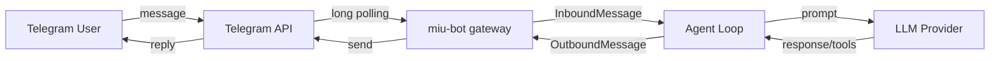

# Setup Guide: Telegram AI Assistant on a Server

Step-by-step guide to deploy miu-bot as a Telegram AI assistant on a Linux server.

## Prerequisites

- Linux server (Ubuntu 22.04+ recommended) or any machine with Python 3.11+
- LLM API key (OpenRouter, Anthropic, OpenAI, or any supported provider)
- Telegram account

## 1. Install miu-bot

### Option A: pip/uv (recommended for production)

```bash
# Using uv (fastest)
uv tool install miu-bot-ai

# Or using pip
pip install miu-bot-ai
```

### Option B: From source (latest features)

```bash
git clone https://github.com/dataplanelabs/miu-bot.git
cd miu-bot
pip install -e .
```

### Option C: Docker

```bash
docker build -t miu-bot .
```

## 2. Initialize Configuration

```bash
miu-bot onboard
```

Creates `~/.miu_bot/config.json` with defaults.

## 3. Create Telegram Bot

1. Open Telegram, search for **@BotFather**
2. Send `/newbot`
3. Follow prompts to set bot name and username
4. Copy the **bot token** (format: `123456789:ABCdefGHIjklMNOpqrSTUvwxYZ`)

### Get Your User ID

Option A: Search for **@userinfobot** on Telegram, start it, and it shows your numeric user ID.

Option B: Check Telegram settings for your username (without `@`).

## 4. Configure miu-bot

Edit `~/.miu_bot/config.json`:

```json
{
  "agents": {
    "defaults": {
      "model": "anthropic/claude-sonnet-4-20250514",
      "maxTokens": 4096,
      "temperature": 0.7,
      "memoryWindow": 50
    }
  },
  "providers": {
    "openrouter": {
      "apiKey": "sk-or-v1-YOUR_KEY_HERE"
    }
  },
  "channels": {
    "telegram": {
      "enabled": true,
      "token": "YOUR_BOT_TOKEN_HERE",
      "allowFrom": ["YOUR_USER_ID"]
    }
  },
  "tools": {
    "web": {
      "search": {
        "apiKey": "YOUR_BRAVE_SEARCH_KEY"
      }
    }
  }
}
```

### Configuration Notes

| Field | Required | Description |
|-------|----------|-------------|
| `agents.defaults.model` | Yes | LLM model to use. Format: `provider/model-name` |
| `providers.*.apiKey` | Yes | At least one provider API key |
| `channels.telegram.token` | Yes | Bot token from BotFather |
| `channels.telegram.allowFrom` | Recommended | User IDs allowed to chat. Empty = anyone can use |
| `channels.telegram.proxy` | Optional | HTTP/SOCKS5 proxy (e.g., `socks5://127.0.0.1:1080`) |
| `tools.web.search.apiKey` | Optional | Brave Search API key for web search capability |

### Provider Examples

**Anthropic (Claude direct):**
```json
{
  "providers": {
    "anthropic": { "apiKey": "sk-ant-..." }
  },
  "agents": {
    "defaults": { "model": "claude-sonnet-4-20250514" }
  }
}
```

**OpenAI:**
```json
{
  "providers": {
    "openai": { "apiKey": "sk-..." }
  },
  "agents": {
    "defaults": { "model": "gpt-4o" }
  }
}
```

**DeepSeek:**
```json
{
  "providers": {
    "deepseek": { "apiKey": "sk-..." }
  },
  "agents": {
    "defaults": { "model": "deepseek-chat" }
  }
}
```

## 5. Test Locally

```bash
# Quick test via CLI
miu-bot agent -m "Hello, are you working?"

# Interactive mode
miu-bot agent

# Check status
miu-bot status
```

## 6. Start the Gateway

```bash
miu-bot gateway
```

This starts the Telegram bot (and any other enabled channels). The bot uses long polling — no public IP or port forwarding needed.

Open Telegram, find your bot, and send a message.

## 7. Run as a Background Service (Production)

### Option A: systemd (recommended for Linux servers)

Create `/etc/systemd/system/miu-bot.service`:

```ini
[Unit]
Description=miu-bot AI Assistant Gateway
After=network.target

[Service]
Type=simple
User=YOUR_USERNAME
ExecStart=/usr/local/bin/miu-bot gateway
Restart=always
RestartSec=10
Environment=HOME=/home/YOUR_USERNAME

[Install]
WantedBy=multi-user.target
```

```bash
sudo systemctl daemon-reload
sudo systemctl enable miu-bot
sudo systemctl start miu-bot

# Check logs
sudo journalctl -u miu-bot -f
```

### Option B: Docker (recommended for containerized deploys)

```bash
docker run -d \
  --name miu-bot \
  --restart unless-stopped \
  -v ~/.miu-bot:/root/.miu-bot \
  miu-bot gateway
```

### Option C: tmux/screen (quick setup)

```bash
tmux new -s miu-bot
miu-bot gateway
# Ctrl+B, D to detach
# tmux attach -t miu-bot to reattach
```

## 8. Add MCP Servers (Optional)

Extend capabilities with MCP tool servers:

```json
{
  "tools": {
    "mcpServers": {
      "filesystem": {
        "command": "npx",
        "args": ["-y", "@modelcontextprotocol/server-filesystem", "/home/user/data"]
      },
      "web-search": {
        "url": "https://your-mcp-endpoint.com/sse"
      }
    }
  }
}
```

Requires Node.js 18+ for stdio-based MCP servers.

## 9. Voice Message Support (Optional)

Add Groq for free Whisper transcription of Telegram voice messages:

```json
{
  "providers": {
    "groq": {
      "apiKey": "gsk_YOUR_GROQ_KEY"
    }
  }
}
```

## 10. Security Hardening (Production)

```json
{
  "tools": {
    "restrictToWorkspace": true
  },
  "channels": {
    "telegram": {
      "allowFrom": ["YOUR_USER_ID"]
    }
  }
}
```

- **`restrictToWorkspace: true`** — Sandboxes all file/shell operations to `~/.miu_bot/workspace/`
- **`allowFrom`** — Only listed user IDs can interact with the bot
- Set config file permissions: `chmod 600 ~/.miu_bot/config.json`
- Use separate API keys for dev/production
- Run as non-root user

## Troubleshooting

| Issue | Solution |
|-------|----------|
| Bot not responding | Check `miu-bot status` for config issues. Verify bot token. Check `allowFrom` includes your user ID |
| LLM errors | Verify provider API key. Check model name format matches provider |
| Connection issues in China | Use `proxy` field in Telegram config or use providers with China access (DeepSeek, Zhipu, DashScope) |
| Voice messages not transcribed | Add Groq provider with API key |
| Permission denied on files | Check `restrictToWorkspace` setting. Verify file permissions |

## Architecture Reference


