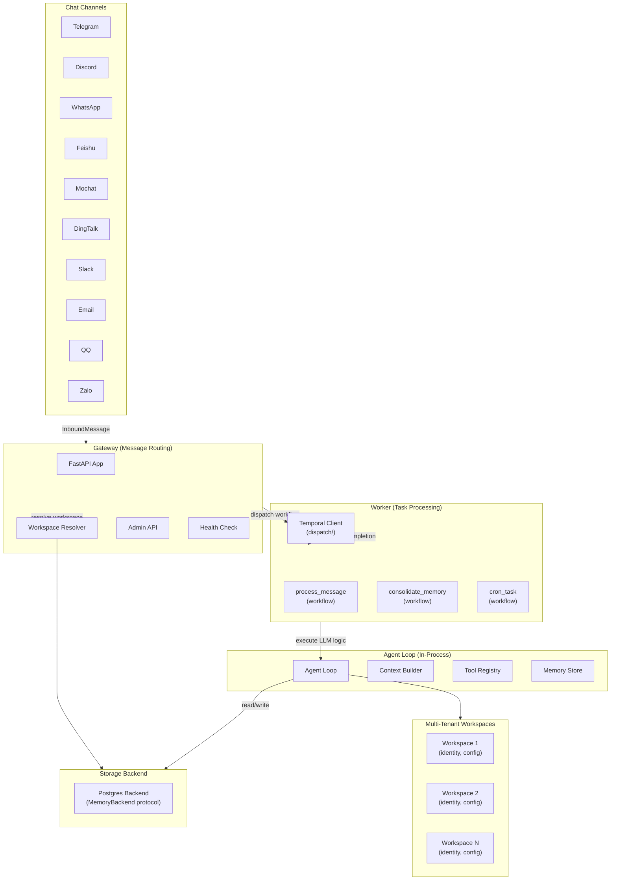
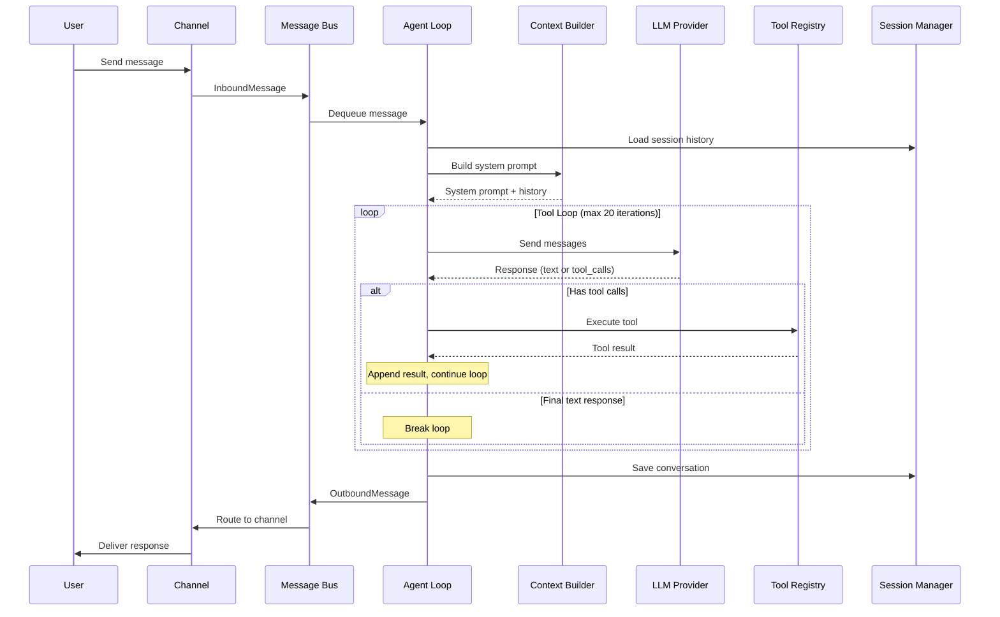
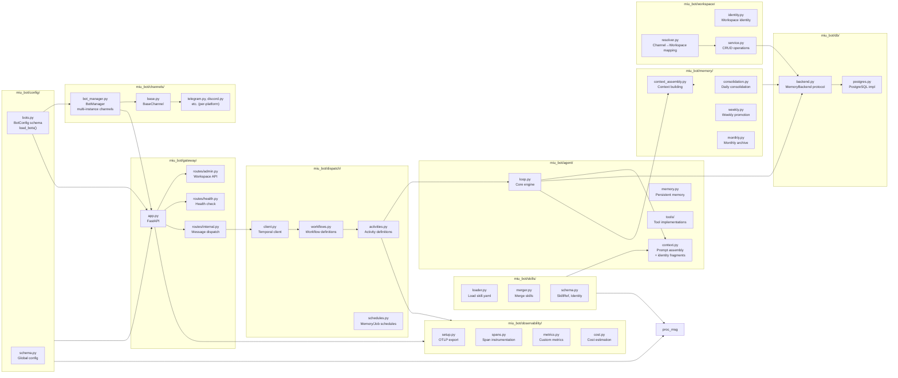
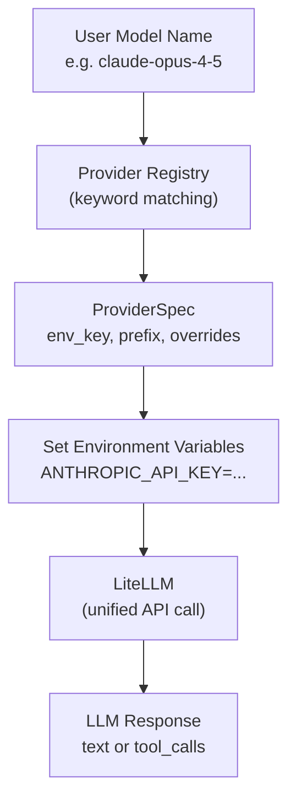
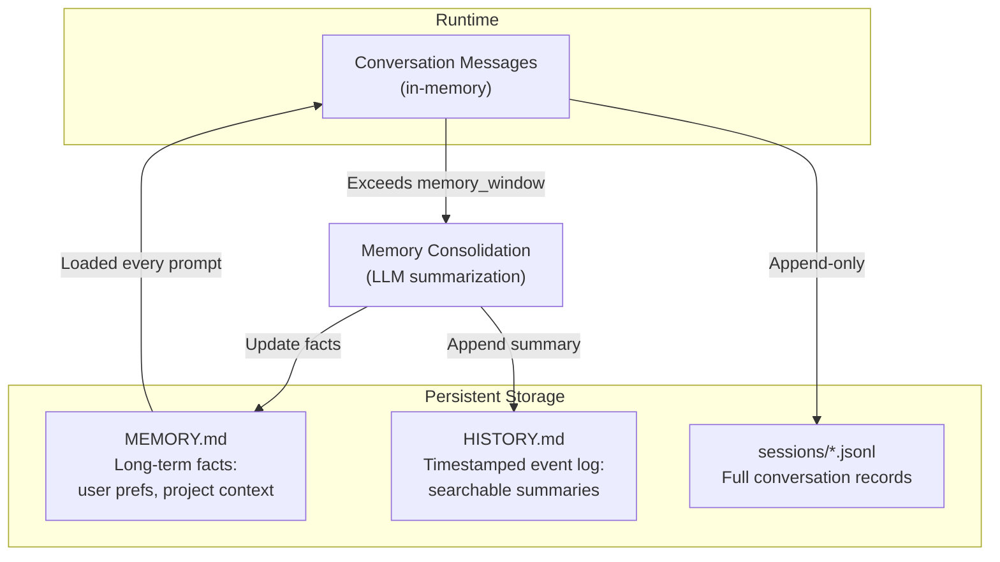
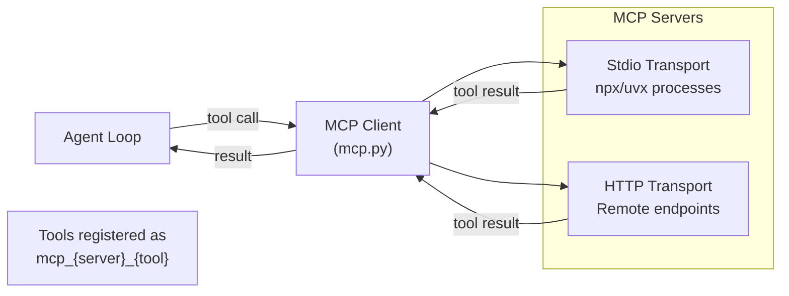
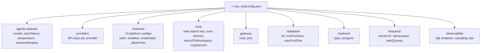
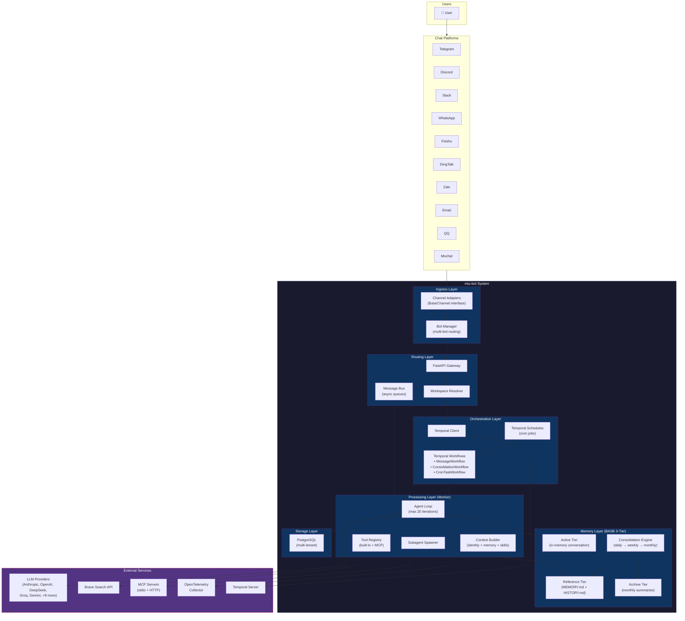

# System Architecture

**Fork of [HKUDS/nanobot](https://github.com/HKUDS/nanobot)** with key architectural enhancements:
- **PostgreSQL backend** replacing JSON file storage for multi-tenant support
- **Temporal workflows** for durable, deterministic, distributed orchestration
- **Multi-tenant architecture** with Gateway/Worker separation for scalability
- **Kubernetes-native** deployment with Helm charts and horizontal pod autoscaling
- **OpenTelemetry observability** for distributed tracing and cost analytics

## Overview

miu-bot is an ultra-lightweight personal AI assistant (~3,663 LOC core agent) built with Python 3.11+. It now supports **multi-bot workspace architecture** with three deployment modes: **Combined** (single-process), **Gateway** (message routing), and **Worker** (task processing). The system uses an async-first, event-driven architecture with decoupled modules communicating through a message bus and durable task orchestration via Temporal. The **multi-bot workspace** feature allows managing multiple bot instances with separate identities, providers, channels, and skills within a single deployment.

## High-Level Architecture (Multi-Tenant)



## Core Data Flow



## Module Architecture (Multi-Bot Workspace Structure)



## Deployment Modes

### Combined Mode (Single-Process)
- **Command:** `miubot serve --role combined`
- **Use case:** Development, single-tenant deployments
- **Components:** Channels + Agent + Gateway API in one process
- **Port:** Configurable (default: 18790)

### Gateway Mode (Message Router)
- **Command:** `miubot serve --role gateway [--bots-config /path/to/bots.yaml]`
- **Use case:** Multi-bot, multi-tenant, message ingestion + routing
- **Components:** FastAPI server, BotManager (multi-bot channel orchestration), workspace resolver, Temporal client
- **Responsibilities:**
  - Load bot definitions from `bots.yaml` (channels, identities, provider configs)
  - Listen on multiple chat channels via BotManager (one channel instance per bot)
  - Auto-create workspaces from `bots.yaml` at startup
  - Resolve workspace_id from bot_name + channel/user (via WorkspaceResolver)
  - Dispatch messages to Temporal workflow queue with workspace + bot context
  - Health checks, admin API for workspace management
- **No agent execution:** Delegates processing to workers via Temporal
- **Durable Workflows:** Per-session workflows with infinite loop (ContinueAsNew every 500 messages)

### Worker Mode (Task Executor)
- **Command:** `miubot serve --role worker [--bots-config /path/to/bots.yaml] [--bot-filter bot1,bot2]`
- **Use case:** Multi-bot, multi-tenant, horizontal scaling, distributed task processing
- **Components:** Temporal worker with activities, per-bot agent loop with identity/provider/skills
- **Responsibilities:**
  - Load bot definitions from `bots.yaml` (identities, provider configs, MCP tools, skills, jobs)
  - Poll Temporal task queues for workflows (message, consolidate_memory, cron_task, schedules)
  - Optional `--bot-filter` for worker isolation (process only specific bot task queues)
  - For each message workflow:
    - Extract bot_name and workspace_id from workflow input
    - Load bot identity, skills (skill.yaml files with identity fragments + rules)
    - Create per-workspace LLM provider + tools registry (MCP servers per bot)
    - Execute agent logic with streaming support via Temporal queries
  - For each cron job execution:
    - Execute CronTaskProcessor with bot context
    - Deliver job results to configured target channels (multi-target delivery)
  - Read/write workspace data via backend (Postgres or File)
  - Report completion back to Temporal
  - Memory consolidation via daily/weekly/monthly cron schedules (Temporal native)
  - Cron job scheduling via Temporal native schedules (job definitions from bots.yaml)

## Multi-Bot Workspace Architecture

The multi-bot feature allows a single miu-bot deployment to manage **multiple bot instances**, each with its own:
- **Identity** (system prompt, personality, behavior)
- **LLM Provider** (separate API keys, model selection per bot)
- **Channels** (independent tokens per bot; each bot can listen on different platforms)
- **Skills** (skill.yaml files with bot-specific rules, identity fragments, MCP tools)

### Configuration Flow

```
bots.yaml
    ├─ bot1:
    │   ├─ identity: /path/to/bot1-identity.md
    │   ├─ provider: {model, api_key_env}
    │   ├─ channels: {telegram, discord, etc.} (per-bot tokens)
    │   └─ skills: [{name, source, rules}]
    ├─ bot2:
    │   ├─ identity: /path/to/bot2-identity.md
    │   ├─ provider: {model, api_key_env}
    │   └─ ...
    └─ tools_presets: {default_tools, ...}  # Shared MCP configs
```

**Load Flow:**
1. **Gateway Startup** → `load_bots(bots.yaml)` → BotManager initializes channels
2. **Gateway** → `_resolve_env_fields()` → Resolves `*_env` to actual tokens from environment
3. **BotManager** → Creates one channel instance per bot (keyed `{bot_name}:{channel_type}`)
4. **Inbound Message** → Tagged with `bot_name` → Temporal workflow includes bot context
5. **Worker** → Receives message with `bot_name` → Loads bot identity + skills → Executes agent

### Skills System (skill.yaml)

Each skill is a YAML file with identity fragments, tool rules, and MCP configs:

```yaml
---
description: Research skill for bot2
identity_fragments:
  - "You are expert at research synthesis."
  - "Always cite sources."
tool_rules:
  exec: disabled
  web_search: enabled
mcp_servers:
  filesystem: {url: "http://mcp:3000"}
---

# Skill instructions in markdown...
```

**Merger:** When loading skills for a bot, the merger combines:
- Global identity (from bot identity file)
- Per-skill identity fragments
- Tool rules (per-bot overrides)
- MCP server configs (bot-specific or preset-inherited)

Result: Per-workspace context assembly with all bot-specific metadata.

## Multi-Tenant Storage

### Backend Protocol (MemoryBackend)
Unified interface for session and memory storage:
- **Postgres Backend** (`db/postgres.py`) — Production multi-tenant

Implements:
- Session CRUD (get_or_create_session, append_message, get_messages)
- Memory CRUD (get_memory, update_memory)

### Workspace Templates & Skills

Separated workspace template management with dedicated database tables:

**workspace_templates table:**
- Stores per-workspace templates (soul, user, agents, heartbeat configs)
- Columns: id, workspace_id, template_type, content, config (JSONB), timestamps
- Unique constraint: (workspace_id, template_type)
- Replaces inline storage in config_overrides

**workspace_skills table:**
- Stores per-workspace skill definitions (replaces inline config)
- Columns: id, workspace_id, name, description, identity, rules (JSONB), mcp_servers (JSONB), tags, source, source_version, enabled, timestamps
- Unique constraint: (workspace_id, name)
- Supports inline and local file sources
- Per-skill rules, identity fragments, and MCP server configs

**Load flow:**
1. Worker receives workflow with workspace_id + bot_name
2. Loads workspace templates and skills from dedicated tables
3. If templates absent, falls back to legacy identity field
4. Merges skill identity fragments + rules + MCP servers into context

### Workspace Resolver
Maps incoming messages to workspaces:
- **Channel + User ID** → Workspace ID
- Configurable mapping (per-channel, per-user rules)
- Fallback to default workspace if unresolved

## Module Responsibilities

### Agent Core (`miu_bot/agent/`)

| File | LOC | Responsibility |
|------|-----|----------------|
| `loop.py` | ~477 | Main processing engine. Receives messages, calls LLM iteratively with tool support, manages feedback loops, triggers memory consolidation |
| `context.py` | ~239 | Assembles system prompts from identity files, memory, skills, and conversation history. Supports multimodal (base64 images) |
| `memory.py` | ~31 | Two-layer persistent memory: MEMORY.md (facts) + HISTORY.md (event log) |
| `skills.py` | ~229 | Loads markdown-based skills with frontmatter metadata. Supports always-on and progressive loading |
| `subagent.py` | ~258 | Spawns background agents with focused prompts, isolated tool sets, max 15 iterations |

### Tools (`miu_bot/agent/tools/`)

| Tool | File | Description |
|------|------|-------------|
| `exec` | `shell.py` | Shell command execution with safety guards (blocks `rm -rf`, fork bombs, etc.), 60s timeout |
| `read_file` | `filesystem.py` | Read file contents |
| `write_file` | `filesystem.py` | Write/create files |
| `edit_file` | `filesystem.py` | Edit existing files |
| `list_dir` | `filesystem.py` | List directory contents |
| `web_search` | `web.py` | Search via Brave Search API |
| `web_fetch` | `web.py` | Extract content from URLs using Readability |
| `message` | `message.py` | Cross-channel messaging |
| `spawn` | `spawn.py` | Spawn subagents for background tasks |
| `cron` | `cron.py` | Schedule recurring/one-time tasks |
| `mcp_*` | `mcp.py` | MCP server tools (dynamically registered) |

### Channels (`miu_bot/channels/`)

All channels implement the same interface: `start()`, `stop()`, `send()`, `is_allowed()`, `_handle_message()`.

| Channel | Transport | Media Support | Public IP Needed |
|---------|-----------|---|------------------|
| Telegram | Long polling | Built-in | No |
| Discord | WebSocket gateway | Built-in | No |
| WhatsApp | Node.js bridge (WebSocket) | Built-in | No |
| Feishu | WebSocket long connection | Built-in | No |
| Mochat | Socket.IO + msgpack | Built-in | No |
| DingTalk | Stream mode | Built-in | No |
| Slack | Socket mode | Built-in | No |
| Email | IMAP polling + SMTP | Attachments | No |
| QQ | botpy SDK (WebSocket) | Built-in | No |
| Zalo | ZCA-CLI WebSocket bridge | Markers via `zalo_media.py` | No |

### Providers (`miu_bot/providers/`)

Registry-driven design. Adding a provider = 2 steps (add `ProviderSpec` + config field).



Supported providers: Custom, OpenRouter, Anthropic, OpenAI, DeepSeek, Groq, Gemini, Zhipu, DashScope/Qwen, Moonshot/Kimi, MiniMax, AiHubMix, vLLM.

### Gateway (`miu_bot/gateway/`)

| File | Responsibility |
|------|----------------|
| `app.py` | FastAPI application, route registration, startup/shutdown |
| `routes/admin.py` | Workspace CRUD endpoints (POST/GET/PUT/DELETE) |
| `routes/health.py` | Health checks for orchestration (K8s liveness/readiness) |
| `routes/internal.py` | Internal APIs for message dispatch, logging |

### Dispatch (`miu_bot/dispatch/`)

Durable workflow orchestration via Temporal.

| File | Responsibility |
|------|----------------|
| `client.py` | Temporal client initialization and connection management |
| `worker.py` | Temporal worker startup with task queue routing and bot filtering |
| `workflows.py` | Workflow definitions (message, consolidate_memory, cron_task workflows) |
| `activities.py` | Activity implementations (thin wrappers around core logic in agent/, memory/, cron_task/) |
| `schedules.py` | Temporal schedule definitions (daily/weekly/monthly consolidation + cron jobs from bots.yaml) |
| `gateway.py` | Gateway-side Temporal client for message dispatch |

**Key Features:**
- Per-session durable workflows with infinite loop (ContinueAsNew pattern every 500 messages)
- Per-bot task queue routing via `--bot-filter` flag for worker isolation
- Cron job scheduling via Temporal native schedules (loaded from bots.yaml `jobs:` field)
- Multi-target job delivery (Telegram, Zalo, Discord, etc. via JobTarget config)
- Temporal Lite for development, self-hosted OSS + dedicated CNPG for production
- Full event history across session restarts
- Streaming via Temporal query-based state transport (no extra HTTP endpoints)

### Observability (`miu_bot/observability/`)

OpenTelemetry-based distributed tracing, metrics, and cost tracking.

| File | Responsibility |
|------|----------------|
| `setup.py` | OTLP exporter (gRPC/HTTP) configuration, sampler setup |
| `spans.py` | Span instrumentation for message receive, LLM calls, tool execution, memory consolidation |
| `metrics.py` | Custom metrics (messages.received, llm.latency_seconds, llm.tokens, tool.latency_seconds, consolidation.cost_usd) |
| `cost.py` | Cost estimation by model (token counts → USD per provider) |

**Key Features:**
- Full request tracing: message_received → task_enqueued → llm_call → tool_execution → response_sent
- Trace ID and span ID injection into loguru logs
- Configurable sampling rate and export interval
- Loguru integration for structured logging with observability context

### Memory (`miu_bot/memory/`)

BASB 3-tier memory consolidation engine with daily/weekly/monthly lifecycle (replaces APScheduler with Temporal native schedules).

| File | Responsibility |
|------|----------------|
| `consolidation.py` | Daily consolidation: summarize conversation, extract facts to MEMORY.md, append to HISTORY.md |
| `weekly.py` | Weekly promotion: elevate stable knowledge, compress daily notes |
| `monthly.py` | Monthly archival: generate deep summaries, move old Reference memories to Archive |
| `context_assembly.py` | Assemble MEMORY.md + HISTORY.md into context for LLM prompt |
| `prompts.py` | LLM prompts for consolidation tasks |

**Key Features:**
- Active tier: In-memory conversation messages (current session)
- Reference tier: Facts from MEMORY.md (loaded per prompt)
- Archive tier: Compressed monthly summaries in database
- Per-workspace timezone support for consolidation schedules
- New database tables: daily_notes, consolidation_log, extended memories with tier/priority/expires_at

### Workspace (`miu_bot/workspace/`)

| File | Responsibility |
|------|----------------|
| `identity.py` | Workspace metadata (id, name, owner, created_at) |
| `config_merge.py` | Merge workspace-level config overrides with global config |
| `service.py` | CRUD operations (create, list, get, update, pause, delete) |
| `resolver.py` | Map channel/user to workspace_id via configurable rules |

### Database (`miu_bot/db/`)

| File | Responsibility |
|------|----------------|
| `backend.py` | MemoryBackend protocol (abstract base) |
| `postgres.py` | PostgreSQL implementation with async connection pooling |
| `pool.py` | Async connection pool management (asyncpg) |
| `migrations/` | Alembic migrations for schema versioning |
| `import_legacy.py` | Migrate old single-tenant data to multi-tenant Postgres |

## Zalo Media Flow

The Zalo channel supports media sending (images, files) via marker-based protocol:

```
LLM Output
    |
    v
[send-image:/path/to/file] or [send-file:/path|Caption]
    |
    v
extract_media_markers() - Zalo media module
    |
    +---> Media items (kind, path, caption)
    |
    +---> Cleaned text (markers removed)
    |
    v
send_media(ws, item) - dispatch to ZCA bridge via WebSocket
    |
    v
Bridge handler (TypeScript)
    |
    +---> downloadToTemp(url) if URL
    |
    +---> send-image or send-file payload
    |
    v
Zalo API
```

**Marker syntax:**
- Images: `[send-image:/path/to/image.jpg]` or `[send-image:https://example.com/image.png]`
- Files: `[send-file:/path/to/file.pdf]` or `[send-file:/path|Caption text]`

Files with absolute paths use `filePath` in payload; URLs use `url` field. The system prompt teaches the LLM this convention; system prompts are generated per-channel in `context.py`.

## Vision Fallback Routing

When processing messages with image attachments, the agent loop follows a **3-path routing strategy** based on model vision capabilities and fallback configuration:

```
Message with Images
    |
    v
Path 1: Model supports vision? ✓
    |
    +---> Send images directly as base64 inline (image_url parts)
    |
    v
Response handling
    |
    v
Path 2: Model doesn't support vision, vision_fallback_model configured? ✓
    |
    +---> Call describe_images() with fallback model
    |
    +---> Convert images to text descriptions via vision fallback
    |
    +---> Send descriptions as text parts to primary model
    |
    v
Response handling
    |
    v
Path 3: No vision support, no fallback configured ✗
    |
    +---> Strip image parts (text parts preserved)
    |
    v
Send text-only message to primary model
```

**Configuration:**

```yaml
bots:
  bot1:
    provider:
      model: "openai/gpt-4o"                    # Primary model (vision or non-vision)
      vision_fallback_model: "glm-4v"           # Fallback vision model for image descriptions
      api_key_env: OPENAI_API_KEY
```

**Key behaviors:**

- **Path 1 (Native Vision):** Images sent as base64 inline (fastest, no extra calls)
- **Path 2 (Fallback Vision):** Image descriptions generated via `describe_images()` using `vision_fallback_model`. Descriptions wrapped in `<image_description untrusted="true">` tags for clarity
- **Path 3 (No Vision):** Images silently stripped; text portions of message preserved. Ensures graceful degradation

**Implementation:** `media_resolver.py:describe_images()` and `process_message.py` (worker workflow) handle all three paths automatically.

## Memory System



**Consolidation trigger:** When session messages exceed `memory_window` (default: 50). Old messages are summarized by the LLM, facts extracted to MEMORY.md, timeline appended to HISTORY.md. Original session messages remain untouched (append-only).

## Cron Job Scheduling

Scheduled cron jobs are defined per-bot in `bots.yaml` and executed via Temporal native schedules:

```yaml
bots:
  bot1:
    jobs:
      morning_briefing:
        description: "Daily morning summary"
        schedule: "0 8 * * *"        # Cron expression (8 AM daily)
        timezone: "America/New_York" # Per-job timezone
        enabled: true
        prompt: "Summarize the top 5 news items for today"
        targets:
          - channel: telegram
            chat_id_env: BOT1_BRIEFING_CHAT_ID  # Resolved from environment
          - channel: zalo
            chat_id_env: BOT1_ZALO_GROUP_ID
```

**Job Execution Flow:**

```
Temporal Schedule (cron expression)
    |
    v
Trigger CronTaskWorkflow
    |
    v
run_cron_activity (dispatch/activities.py)
    |
    v
CronTaskProcessor (worker/workflows/cron_task.py)
    |
    +---> Load bot context (identity, provider, skills)
    |
    +---> Execute agent loop with job prompt
    |
    +---> Send results to targets (Telegram, Zalo, etc.)
    |
    v
Multi-target delivery complete
```

**Job Configuration:**

| Field | Purpose | Example |
|-------|---------|---------|
| `schedule` | Cron expression | `"0 8 * * 1-5"` (8 AM weekdays) |
| `timezone` | IANA timezone for schedule | `"UTC"`, `"America/New_York"` |
| `enabled` | Enable/disable job | `true` |
| `prompt` | What to ask the bot | `"Summarize top news"` |
| `targets` | Delivery destinations | `[{channel, chat_id_env}]` |

**Key Features:**
- YAML-driven job definitions per bot (no code changes to add jobs)
- Temporal native scheduling (CronTaskWorkflow triggered by schedule)
- Per-job timezone support for accurate execution
- Multi-target delivery (same output sent to multiple channels)
- Environment variable resolution for sensitive target IDs (`chat_id_env`)
- CronTaskProcessor orchestrates execution with full bot context (identity, provider, skills)

## MCP Integration



MCP servers defined in config are connected at agent startup. Their tools are discovered and registered alongside built-in tools. The LLM uses them seamlessly via the same tool-call mechanism.

## Configuration Schema

### Global Config (~/.miu_bot/config.json)



**Config sections for multi-tenant + multi-bot:**
- **database** — PostgreSQL connection settings (optional for Postgres backend)
- **backend** — Storage backend selection (postgres)
- **temporal** — Durable workflow orchestration (Temporal server URL, namespace, task queues, optional bot-filter)
- **observability** — OpenTelemetry configuration (OTLP exporter, sampling rate)

### Multi-Bot Workspace Config (bots.yaml)

```yaml
tools_presets:
  default_tools:
    mcp_servers:
      filesystem:
        url: http://mcp-server:3000

bots:
  bot1:
    # Legacy identity (backward compatible)
    identity: /path/to/bot1-identity.md
    # New separated templates (preferred)
    soul: /path/to/bot1-soul.md
    user: /path/to/bot1-user.md
    agents: /path/to/bot1-agents.md
    provider:
      model: openai/gpt-4o
      api_key_env: OPENAI_API_KEY
    channels:
      telegram:
        token_env: BOT1_TELEGRAM_TOKEN
        allow_from: [12345]
      discord:
        token_env: BOT1_DISCORD_TOKEN
    tools:
      mcp_servers:
        filesystem: ~  # Inherit from preset
    jobs:
      morning_briefing:
        description: "Daily news summary"
        schedule: "0 8 * * *"
        timezone: "America/New_York"
        enabled: true
        prompt: "Summarize top 5 news items"
        targets:
          - channel: telegram
            chat_id_env: BOT1_NEWS_CHAT_ID
          - channel: discord
            chat_id_env: BOT1_DISCORD_CHANNEL_ID

  bot2:
    soul: /path/to/bot2-soul.md
    user: /path/to/bot2-user.md
    agents: /path/to/bot2-agents.md
    provider:
      model: anthropic/claude-opus-4
      api_key_env: ANTHROPIC_API_KEY
    channels:
      telegram:
        token_env: BOT2_TELEGRAM_TOKEN
    skills:
      - name: research
        source: /path/to/research-skill.yaml
```

**Key features:**
- Per-bot templates (soul, user, agents) replaces legacy identity field
- Workspace templates stored in database (workspace_templates table)
- Per-bot providers (LLM model + API keys via env vars)
- Per-bot channels (each bot listens on channels with separate tokens)
- Per-bot skills loaded from workspace_skills table
- Per-bot jobs (cron-scheduled tasks with multi-target delivery)
- Tools presets for shared MCP configuration
- Environment variable resolution for sensitive data (tokens, API keys, chat IDs)
- Legacy identity field supported for backward compatibility

## Filesystem Layout

```
~/.miu_bot/
├── config.json              # Main configuration (database, temporal, observability)
├── workspace/               # Local workspace (for CLI agent mode)
│   └── ...
└── history/
    └── cli_history

# Data stored in PostgreSQL:
# - workspaces table (id, name, owner, config_overrides, etc.)
# - sessions table (workspace_id, channel, user_id, messages JSONL)
# - workspace_memories table (workspace_id, memory_md, history_md)
# - workspace_templates table (soul, user, agents, heartbeat per workspace)
# - workspace_skills table (per-workspace skill definitions)
# - daily_notes, consolidation_log (memory consolidation)
```

## Security Model

| Layer | Mechanism |
|-------|-----------|
| Shell execution | Blocks dangerous patterns (rm -rf, fork bombs, disk format). Timeout enforcement. Output truncation |
| Access control | `allowFrom` whitelist per channel. Empty = allow all |
| File access | Optional `restrictToWorkspace` confines all tools to workspace dir |
| API keys | Stored in config.json (recommended 0600 permissions). Env var fallback |
| MCP | Stdio processes sandboxed by OS. HTTP endpoints require explicit config |

## CI/CD Pipeline

### Release Workflow (`.github/workflows/release.yml`)

**Trigger:** Push to main or manual dispatch (`workflow_dispatch`)

**Workflow Steps:**
1. **Auto-version bump** — Increments version tag on main pushes
2. **Create GitHub Release** — Automated release creation with asset links
3. **Build Docker Image** — Multi-stage build optimized for production
4. **Push to GHCR** — Image registry at `ghcr.io/dataplanelabs/miu-bot`
5. **Publish Helm Chart** — Packages chart and pushes OCI artifact to GHCR

**Image Tags:**
- `{sha_short}` — Short commit SHA for precise versioning
- `latest` — Most recent stable image
- `main` — Latest main branch build
- `{version}` — Semantic version tag (e.g., `v0.3.0`)

**Automation:**
- Uses GitHub App (`munmiu`) for secure tag creation via org secrets
- Side effect: Auto-created releases trigger existing `publish.yml` → PyPI publishing
- Manual dispatch allows custom version input

**Path Filters:**
- Only rebuilds on changes to: `miu_bot/**`, `Dockerfile`, `pyproject.toml`, `charts/**`

### Kubernetes Deployment Strategy

**Helm Chart:**
- Chart at `charts/miu-bot/` in the miu-bot repo
- Published as OCI artifact to `oci://ghcr.io/dataplanelabs/charts/miu-bot`
- Templates: namespace, configmap, gateway deployment/service, worker deployment/HPA
- Secrets managed via `existingSecret` pattern (SOPS-encrypted in infra repo)

**Rolling Update & Graceful Shutdown:**

Both Gateway and Worker deployments use a **RollingUpdate strategy** with graceful shutdown to minimize request loss during pod termination:

| Component | maxSurge | maxUnavailable | terminationGracePeriodSeconds | preStop |
|-----------|----------|----------------|-------------------------------|---------|
| Gateway | 1 | 0 | 30s | sleep 5s |
| Worker | 1 | 0 | 120s | N/A |

**Gateway graceful shutdown flow:**
1. K8s removes pod from Service endpoints (readiness probe stops responding)
2. Existing HTTP requests get 5 seconds to complete (`preStop` sleep)
3. SIGTERM sent to container
4. FastAPI shutdown handlers trigger (flush pending messages)
5. Container terminates (max 30s total)

**Worker graceful shutdown flow:**
1. K8s removes pod from Temporal task queue (via gRPC health checks)
2. In-flight workflows (LLM calls, agent loops) allowed up to 120s to complete
3. SIGTERM sent to container
4. Temporal client gracefully disconnects
5. Container terminates (max 120s total)

**ConfigMap checksum annotations:**
- Gateway Pod template includes `checksum/config` + `checksum/bots` (if multi-bot)
- Worker Pod template includes `checksum/config`
- Checksums force pod recreation when ConfigMaps change (automatic redeploy on config updates)

**FluxCD GitOps (infra repo):**
- HelmRelease consumes the OCI chart with prod value overrides
- FluxCD image automation detects new Docker tags and auto-updates HelmRelease
- Cilium network policies restrict ingress/egress per namespace
- Traefik ingress with cert-manager TLS for `miubot.dataplanelabs.com`
- SOPS age-encrypted secrets for database URL, Temporal server URL, API keys

## Technology Stack

| Category | Technology |
|----------|-----------|
| Language | Python 3.11+ |
| CLI | Typer |
| Config | Pydantic + pydantic-settings |
| LLM | LiteLLM (multi-provider) |
| Async | asyncio |
| HTTP | httpx |
| WebSocket | websockets, python-socketio |
| Logging | loguru |
| Terminal UI | Rich, prompt-toolkit |
| JSON | json-repair (robust LLM parsing) |
| Cron | Temporal schedules (croniter for patterns) |
| MCP | mcp SDK |
| Durable Workflows | Temporal |
| Retry Logic | tenacity (exponential backoff) |
| Observability | OpenTelemetry SDK + OTLP exporter |
| LLM Streaming | LiteLLM chat_stream with channel message editing |
| Container Registry | Harbor (Docker images) |
| Helm Charts | OCI artifacts in Harbor |
| GitOps | FluxCD (HelmRelease + image automation) |
| CI/CD | GitHub Actions |
| Orchestration | Kubernetes (Gateway + Worker) |

## Overview Architecture



## Data Model

See [data-model.md](data-model.md) for the full ERD, table purposes, constraints, indexes, and data flow diagrams.
